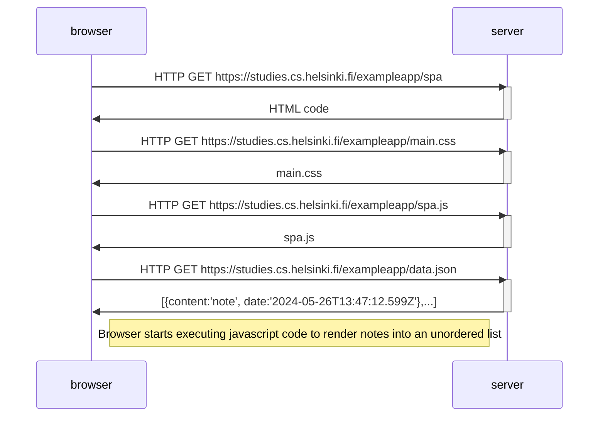

```mermaid
sequenceDiagram
    participant browser
    participant server

    browser->>server: HTTP GET https://studies.cs.helsinki.fi/exampleapp/spa
    activate server
    server->>browser: HTML code
    deactivate server

    browser->>server: HTTP GET https://studies.cs.helsinki.fi/exampleapp/main.css
    activate server
    server->>browser: main.css
    deactivate server

    browser->>server: HTTP GET https://studies.cs.helsinki.fi/exampleapp/spa.js
    activate server
    server->>browser: spa.js
    deactivate server

    browser->>server: HTTP GET https://studies.cs.helsinki.fi/exampleapp/data.json
    activate server
    server->>browser: [{content:'note', date:'2024-05-26T13:47:12.599Z'},...]
    deactivate server

    Note right of browser: Browser starts executing javascript code to render notes into an unordered list
```
