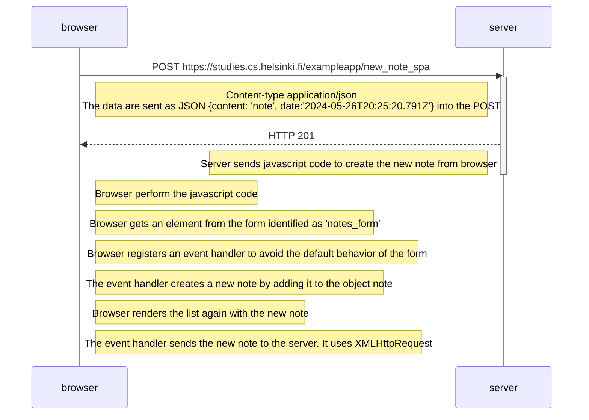

```mermaid
sequenceDiagram
    participant browser
    participant server

    browser->>server: POST https://studies.cs.helsinki.fi/exampleapp/new_note_spa
    activate server
    Note right of browser: Content-type application/json<br />The data are sent as JSON {content: 'note', date:'2024-05-26T20:25:20.791Z'} into the POST
 
    server-->>browser: HTTP 201
  
    Note left of server: Server sends javascript code to create the new note from browser
    deactivate server
  
    Note right of browser: Browser perform the javascript code
    Note right of browser: Browser gets an element from the form identified as 'notes_form'
    Note right of browser: Browser registers an event handler to avoid the default behavior of the form 
    Note right of browser: The event handler creates a new note by adding it to the object note
    Note right of browser: Browser renders the list again with the new note
    Note right of browser: The event handler sends the new note to the server. It uses XMLHttpRequest
```
